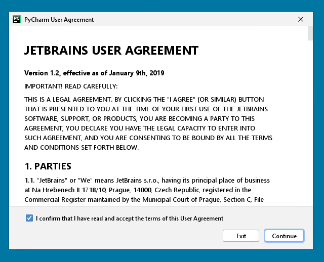

# How to install python

Python is an interpreted language, therefore to be executed you need 
to have a python interpreter installed on your environment.

You can download the python interpreter from the [python website](https://www.python.org/).

The course material is tested using python 3.8.X, newer version of python should work but has not been tested yet.
So feel free to install any `python >= 3.6`.

Then follow the installation steps:

# How to install an IDE

There are several way to program and interact with python. 
Yon can do everything using you favorite text editor and a terminal to execute the code.
However there are dedicated editor to work with programming languages, and in particular 
there are several that it might be used to programming specifically in python.
Some of the most used IDE (Integrated Development Environment) in the python community are:

* [Pycharm](https://www.jetbrains.com/pycharm/)
* [Spyder](https://www.spyder-ide.org/)
* [SublimeText](http://www.sublimetext.com/)
* [VisualStudio](https://code.visualstudio.com)
* [Atom](https://atom.io/)

Feel free to install and use that it seems more interesting for your day-to-day work.

However, for the course it would make easier to follow the course if all the students 
are using the same tool, so that is easier to support you during the course activities.

Therefore, we decide to ask you to install Pycharm:

## How to install Pycharm

First step go to the [Pycharm website](https://www.jetbrains.com/pycharm/), and download the file for your operative system:

Now is time to open the Pycharm IDE.

Inside the eurac's network the pycharm should automatically identify the pycharm server that is:
`http://xdclic03.unibz.it`.
If you receive an error from the server you can get an educational 
license registering to the pycharm website using your eurac's email.

If you select `+ New project` button then you can start selecting what kind of project you want to create, 
and where you can select the python interpreter that you want to use.

